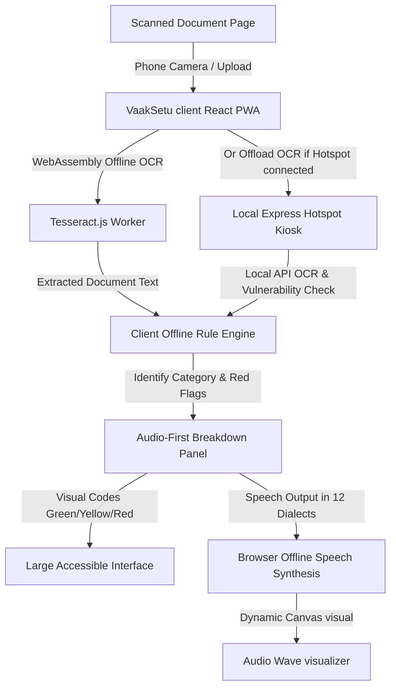

# VaakSetu (वाक् सेतु) — The Voice Bridge 🇮🇳

An offline-first, AI-powered document reader designed to protect and empower illiterate or semi-literate Indians when signing contracts, land deeds, loan papers, and hospital consent forms.

VaakSetu acts as a safety bridge: point any low-cost phone at a document, and hear it explained clearly in your local dialect while immediately highlighting deceptive clauses or red-flag interest rates.

---

## 🚀 Key Features

1. **NO Literacy Required**: The UI is audio-first. Tapping elements plays spoken guides, and large icons combined with a green/yellow/red safety hierarchy ensure clear, non-text communication.
2. **NO Internet / Data Connection Required**:
   - Runs fully on-device inside a **Progressive Web App (PWA)** cache.
   - Extracts text using in-browser WebAssembly-compiled **Tesseract.js**.
   - Translates and assesses hazards using a local client-side Rules Engine.
   - Synthesizes dialect output offline via the device's native browser **SpeechSynthesis API**.
3. **Local Hotspot Kiosk Mode**: Includes an Express backend server allowing local kiosks (e.g., in a village center) to broadcast the app offline over a local Wi-Fi hotspot, offloading computational heavy-lifting from old, Rs.4,000 Android phones.
4. **12 Indian Languages Supported**: Speaks in Hindi, Tamil, Telugu, Marathi, Bengali, Gujarati, Kannada, Malayalam, Odia, Punjabi, Assamese, and Urdu.

---

## 🏗️ Project Architecture



---

## 🛠️ Codebase Structure

- **`client/`**: React Vite application built with accessibility-first standards.
  - [`src/App.jsx`](client/src/App.jsx) - Main view and voice guidance controller.
  - [`src/index.css`](client/src/index.css) - Vibrant, high-contrast, Indian-heritage design system.
  - [`src/components/LanguageSelector.jsx`](client/src/components/LanguageSelector.jsx) - Large grid of 12 native language triggers with pronunciations.
  - [`src/components/CameraScanner.jsx`](client/src/components/CameraScanner.jsx) - Camera capture overlay and offline document presets.
  - [`src/components/DocumentAnalyzer.jsx`](client/src/components/DocumentAnalyzer.jsx) - Performs hybrid WebAssembly OCR and builds the warning layouts.
  - [`src/components/WaveVisualizer.jsx`](client/src/components/WaveVisualizer.jsx) - Canvas voice activity canvas synchronizer.
  - [`src/utils/ruleEngine.js`](client/src/utils/ruleEngine.js) - Evaluates loan interest limits, collateral grabs, unpaid labor, etc.
  - [`src/utils/voiceGuider.js`](client/src/utils/voiceGuider.js) - Speech synthesis voice manager and native script translation prompts.
  - [`public/service-worker.js`](client/public/service-worker.js) - Caches resources for 100% offline standalone usage.
- **`server/`**: Kiosk hotspot server simulating local-network offloading capabilities.
  - [`server.js`](server/server.js) - Express backend with multer upload pipelines and multi-language presets.

---

## ⚡ Setup & Run Instructions

To install and run both parts of the full stack:

### Prerequisite
Make sure you have [Node.js](https://nodejs.org) (v16+) installed.

### 1. Start the Local Hotspot Kiosk Backend
Open a terminal in the project directory:

```bash
cd server
npm install
npm start
```
The server will boot on `http://localhost:5000` (and is broadcastable to any phone on the local Wi-Fi router network at `http://<your-ip>:5000`).

### 2. Start the React Client App
Open another terminal:

```bash
cd client
npm install
npm run dev
```
Vite will host the web interface at `http://localhost:3000`.

---

## 🛡️ Vulnerability Rule Set Examples
VaakSetu detects high-risk fraud factors including:
- **Loans**: Compound interest rates above 24% per annum or assets/agricultural land clauses without legal safeguards.
- **Job Contracts**: Working conditions involving 12-hour mandatory work shifts, overtime without additional pay, or large early-resignation fines/bonds.
- **Hospital Consent**: Total release of liability and negligence waiver clauses.
- **Deeds**: Complete transfer of irrevocable rights without co-owners or spouses signatures.
